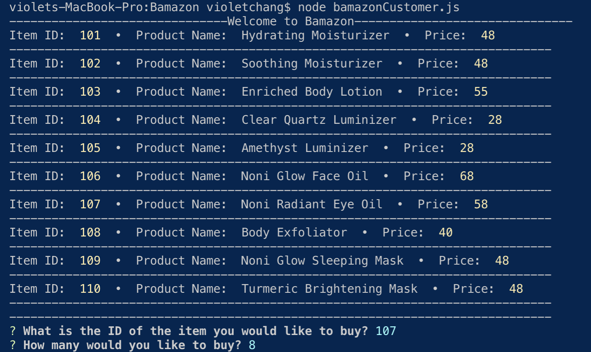

# Bamazon

Bamazon is an Amazon-like storefront app that takes in orders from customers and depletes stock from the store's inventory using MySQL.

Users are shown a list of items to buy, the user chooses an item, then chooses a quantity. The total is shown and if there is not enough of the item in stock, an "insufficient quantity" message is shown.

## Technologies Used

- Node.js
- MySQL

### Developer - Violet Chang
