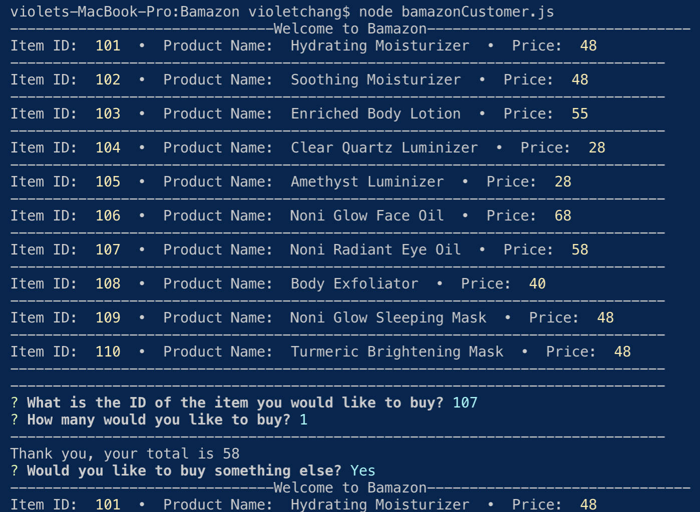
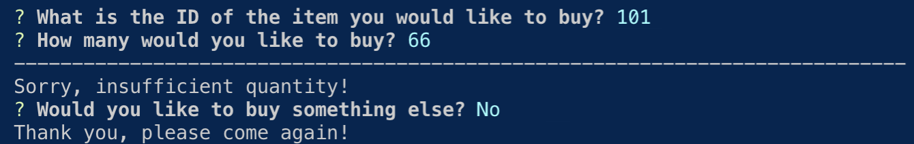

# Bamazon

Bamazon is an Amazon-like storefront app that takes in orders from customers and depletes stock from the store's inventory using MySQL.

Users are shown a list of items to buy, the user chooses an item, then chooses a quantity. The total is shown and if there is not enough of the item in stock, an "insufficient quantity" message is shown.

### **Deployment**
1. Clone repo
2. Run `npm install`
3. Build database from `bamazon.sql`
4. In terminal, run `node bamazonCustomer.js`

## Demo

As shown in the screenshot above, the user sees a list of items that are available to purchase, then is prompted to choose an item to buy. The user chooses a quantity and if that quantity is available, the user is shown the total.

Once the transaction is over, the user is asked if they would like to buy anything else. If yes, as shown in the example above, the list of available items is shown again and the process starts again.

If insufficient quantities are available, the user is shown an insufficient quantity message. In contrast to the previous screenshot, the above screenshot shows what happens when a user decides not to buy something else, they are shown a "Thank you, please come again!" message.

## Technologies Used

- javaScript
- Node.js
- NPM packages
    - Inquirer
    - MySQL

### Developer - Violet Chang
